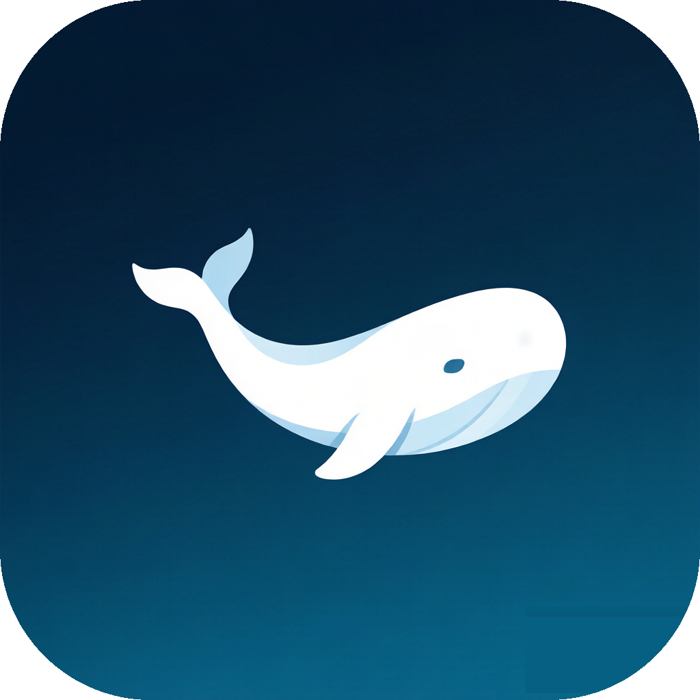

<h1 align="center">
  
  <br />
  DeepSeek Harness Desktop
</h1>

<p align="center">
  把 <a href="https://github.com/deepseek-ai/deepseek-harness">DeepSeek Harness</a> 的 Web UI 装进原生桌面窗口——自动启停本地服务，开箱即用，支持自定义背景与 Token 用量统计。
</p>

<p align="center">
  <a href="https://github.com/67-qingshui/deepseek-harness-desktop/releases/latest"></a>
  <a href="LICENSE"></a>
  
  
</p>

DeepSeek Harness Desktop 把官方 DeepSeek Harness 的 Web 体验打包为独立桌面应用，免去手动启动 CLI 与管理本地端口，同时保留完整的 Harness 界面与能力。

本项目聚焦桌面宿主，不分叉、不修改、不注入 Harness UI——模型、会话、设置、插件与 Agent 能力仍由官方 `@deepseek-ai/dsh` 提供。在此基础上增加了自定义背景与字体颜色、Token 用量统计两项增强。

> [!IMPORTANT]
> 非官方社区封装，依赖快速演进的 `@deepseek-ai/dsh@0.1.0-rc.7`。macOS 构建未做 Apple 公证。

## 下载

三个版本均可独立使用，高版本包含低版本全部功能。

| 版本 | 特色 | 下载 |
| --- | --- | --- |
| v1.0.0 纯净版 | 极简宿主壳，零自定义 | [⬇ dmg](https://github.com/67-qingshui/deepseek-harness-desktop/releases/download/v1.0.0/DeepSeek-Harness-Desktop-1.0.0-arm64.dmg) |
| v1.1.0 DIY 背景版 | 自定义背景图片与字体颜色 | [⬇ dmg](https://github.com/67-qingshui/deepseek-harness-desktop/releases/download/v1.1.0/DeepSeek-Harness-Desktop-1.1.0-arm64.dmg) |
| v2.0.0 用量统计版 | 增加 Token 用量统计（最新） | [⬇ dmg](https://github.com/67-qingshui/deepseek-harness-desktop/releases/download/v2.0.0/DeepSeek-Harness-Desktop-2.0.0-arm64.dmg) |

所有版本均可在 [Releases 页](https://github.com/67-qingshui/deepseek-harness-desktop/releases) 查看。不确定选哪个就下 v2.0.0。

## 为什么有这个项目

DeepSeek Harness 已提供完整的 Agent 运行时与 Web UI，本项目补齐桌面产品所需的宿主能力：

- 自动启停本地 Harness 服务
- 分配随机 `127.0.0.1` 回环端口
- 服务就绪后再显示窗口，就绪前展示加载页
- 单实例窗口与安全的跨域导航
- 开启沙箱、`contextIsolation`、导航限制
- 打包可安装的 macOS 产物
- 自定义背景与字体颜色（v1.1.0+）
- Token 用量统计（v2.0.0）

## 功能

**v1.0.0 纯净版（以下功能所有版本共有）**
- 服务就绪后自动载入官方 Harness 界面
- 服务启动期间显示轻量加载页
- 关闭窗口时驻留系统托盘，可随时唤出
- 退出时优雅终止 Harness 子进程
- 仅监听随机本地回环端口
- macOS 标题栏与 Harness 深浅色主题融合
- 自包含运行时：dsh 内嵌进应用，由自带 Electron 运行，**无需预装 Node.js**

**v1.1.0+**
- 自定义背景图片：上传本地图片 / 6 套预设渐变，可调不透明度与模糊
- 自定义字体颜色：颜色选择器自由调色 / 7 套预设方案
- 快速配色：一键切换协调的背景+字体组合
- 入口：托盘「设置…」或 `⌘ ,`，实时生效

**v2.0.0**
- 自动采集 API 响应 `usage` 字段（参考[官方计费规则](https://api-docs.deepseek.com/zh-cn/quick_start/pricing)）
- 统计输入/输出/缓存命中 Token、调用次数、缓存命中率、估算费用
- 可视化：折线图趋势 + 柱状图占比 + 明细列表，5 秒自动刷新
- 入口：托盘「用量统计…」

## 安装

### macOS

构建未做 Apple 公证，首次启动：

1. 打开 DMG，将 **DeepSeek Harness Desktop** 拖入 **Applications**。
2. 尝试打开应用；若 macOS 拦截，点击**完成**。
3. 打开**系统设置 → 隐私与安全性**。
4. 在**安全性**区域找到该应用，点击**仍要打开**。
5. 再次确认点击**打开**。

通常只需确认一次。

**或使用命令行清除隔离标记（可选）：**

```bash
xattr -cr "/Applications/DeepSeek Harness Desktop.app"
```

> **原理**：macOS 会为从互联网下载的应用自动打上 `com.apple.quarantine` 隔离扩展属性，Gatekeeper 据此拦截未公证的应用。`xattr -c` 清除扩展属性，`-r` 递归处理应用包内所有文件；清除后 Gatekeeper 不再拦截，可直接打开。
>
> ⚠️ 此命令会绕过 Gatekeeper 的安全检查，请**仅对信任来源**的应用使用。更稳妥的做法仍是上面手动点击「仍要打开」（保留隔离标记）。

> [!NOTE]
> 本项目**仅支持 macOS Apple Silicon（M 系列芯片）**。当前 Release 只提供 arm64 预编译 dmg，不支持 Intel Mac、Windows 与 Linux。

## 首次使用（API Key）

调用模型功能前需配置 API Key：

1. 在 [DeepSeek 开放平台](https://platform.deepseek.com) 创建 API Key（`sk-` 开头，仅创建时单次展示）
2. 打开本应用，在 Harness Web UI 的**设置页**填入

> [!NOTE]
> **安全**：API Key 由 dsh 在本地管理，本客户端不收集、不存储、不上传，对开发者不可见。
> **多客户端**：同一账号的 Key 可在多个客户端直接使用，无需重复添加。建议按客户端分别创建 Key 并标记名称（如 `desktop-mac`），方便官方后台按渠道统计用量。

## 安全模型

- Harness 仅绑定 `127.0.0.1` 随机端口
- 渲染进程禁用 Node.js 集成
- 启用 `contextIsolation` 与 Chromium 沙箱
- 新窗口与跨域导航交给系统浏览器
- Harness 运行在独立子进程，退出时 tree-kill 回收

## 运行时架构

```text
DeepSeek Harness Desktop
├── Electron Main
│   ├── 单实例窗口
│   ├── Harness 子进程生命周期
│   ├── 随机回环端口与就绪检测
│   ├── 托盘 / 设置窗口 / 用量统计窗口
│   └── 外部链接与跨域导航处理
│
├── Harness Child Process
│   └── @deepseek-ai/dsh web
│       └── http://127.0.0.1:<random-port>
│
└── Sandboxed BrowserWindow
    └── DeepSeek Harness Web UI
        └── usage-inject.cjs（hook fetch/XHR 采集 Token 用量）
```

## 已知限制

- 上游 dsh 仍为 RC 版本，可能快速变化
- 未集成 Apple Developer ID 签名与公证
- **仅支持 macOS Apple Silicon（M 系列芯片）**，不支持 Intel Mac / Windows / Linux
- 用量费用为估算，以官方账单为准
- 未集成自动更新

## 为什么未签名与未公证

本项目未使用 Apple Developer ID 签名，也未做 Apple 公证（Notarization），原因如下：

- **需要付费的开发者账号**：申请签名与公证必须加入 Apple Developer Program（年费 $99/年），而本项目是社区非官方封装，没有开发者账号。
- **非官方社区项目**：本项目与 DeepSeek 官方及任何商业主体无关，属于个人开源项目，通常不申请付费证书。
- **开源项目惯例**：大量开源 macOS 应用同样跳过签名与公证，代价是首次打开需手动「仍要打开」，或使用 `xattr -cr` 清除隔离标记。

> 如你有 Apple Developer 账号，可自行下载源码重签名后使用。本项目不提供签名与公证，敬请理解。

## License

桌面壳基于 [MIT License](LICENSE) 开源。内嵌的 `@deepseek-ai/dsh` 同为 MIT 许可。

本项目与 DeepSeek 官方无隶属关系。DeepSeek Harness 及相关名称归各自所有者所有。

---

*本文档随官方更新与功能迭代持续同步，如有过时请[反馈](https://github.com/67-qingshui/deepseek-harness-desktop/issues)。*
